# next-api-bridge

> Use Next.js as a real server — not just a React wrapper.

**next-api-bridge** is a cookie-aware API gateway for Next.js App Router. It sits between your UI and your external backend, handling cookies, headers, auth, and session flow entirely on the server.

---

## The problem

Most Next.js apps with an external backend fall into this pattern:

```
Client → useEffect → fetch → Backend API
```

This means tokens in `localStorage`, broken `HttpOnly` cookies, duplicated API logic, and a client component that knows too much about your auth.

## The solution

```
Client (UI only)
    ↓
Server Action (Next.js)
    ↓
next-api-bridge
    ↓
External Backend (NestJS · Laravel · Django · Express…)
```



Your client triggers actions. Your server owns the session. Your backend never sees the browser directly.

---

## Install

```bash
npm install next-api-bridge
```

**Optional** — for toast helpers:

```bash
npm install sonner
```

**Requires:** Next.js 13+ (App Router), Node.js server environment. Server Actions, Route Handlers, or Server Components only — not for browser fetch.

---

## Quick start

### 1. Create your API client

```ts
// src/server/api.ts
import { createNextApiBridge } from 'next-api-bridge';

export const api = createNextApiBridge({
  baseUrl: process.env.API_URL!,
});
```

### 2. Call it from a Server Action

```ts
// server/auth/action.ts
'use server';

import { redirect } from 'next/navigation';
import { api } from '@/server/api';
import { getCleanFormData, validateRedirectPath } from 'next-api-bridge/form';

export async function signIn(_prev: unknown, data: FormData) {
  const body = getCleanFormData(data, { delete: ['redirectPath'] });
  const response = await api.post('/auth/login', body);

  if (response.success) redirect(validateRedirectPath(data.get('redirectPath') as string));

  return { formdata: body, ...response };
}
```

### 3. Use it in your form

```tsx
// components/login-form.tsx
'use client';

import { useActionState } from 'react';
import { signIn } from '@/server/auth/action';

export default function LoginForm() {
  const [state, action, isPending] = useActionState(signIn, null);

  return (
    <form action={action}>
      <input name="email" type="email" />
      <input name="password" type="password" />
      <button disabled={isPending}>Sign in</button>
      {state?.message && <p>{state.message}</p>}
    </form>
  );
}
```

No `useEffect`. No `useState` for auth. No token management on the client.

---

## Configuration

```ts
createNextApiBridge({
  baseUrl: string;           // Required. Your backend URL.
  cookiePrefix?: string;     // Default: 'nab_'. Namespaces backend cookies in Next.js.
  apiKey?: string;           // Optional API key.
  apiKeyHeader?: string;     // Header name for the API key.
  auth?: BearerAuthConfig;   // Bearer token from a cookie.
  verbose?: string;          // 'request,body,response' for debug logging.
});
```

### Bearer token auth

Reads a token from a cookie and adds it as an `Authorization` header automatically:

```ts
export const api = createNextApiBridge({
  baseUrl: process.env.API_URL!,
  auth: {
    type: 'bearer',
    tokenCookie: 'accessToken', // reads nab_accessToken cookie
    header: 'Authorization',
    prefix: 'Bearer',
  },
});
```

### API key auth

```ts
export const api = createNextApiBridge({
  baseUrl: process.env.API_URL!,
  apiKey: process.env.API_KEY,
  apiKeyHeader: 'X-API-Key',
});
```

---

## API methods

```ts
api.get('/users/me');
api.post('/auth/login', body);
api.patch('/users/me', body);
api.put('/settings', body);
api.delete('/sessions/current');
```

All methods return:

```ts
{
  success: boolean;
  message: string;
  body: T | null;
  headers?: Headers;
}
```

### Options

```ts
// Query params
api.get('/events', { query: { page: 1, search: 'conf' } });

// Path params
api.get('/events', { params: ['event-id'] });

// Cache control
api.get('/static-data', { cache: 'force-cache' });

// File upload
api.post('/upload', formData, { isMultipart: true });
```

---

## Cookie behavior

When your backend responds with `Set-Cookie: accessToken=abc123`, next-api-bridge captures it and stores it in Next.js as `nab_accessToken`. On the next request, it strips the prefix and forwards `Cookie: accessToken=abc123` to your backend transparently.

`HttpOnly` session cookies work out of the box — no workarounds needed.

### Manual cookie management

```ts
await api.setCookie('sessionid', 'abc123', { httpOnly: true, maxAge: 3600 });
await api.getCookie('accessToken');
await api.deleteCookies(['accessToken', 'refreshToken']); // or pass nothing to delete all
```

---

## Form helpers

`getCleanFormData` replaces `Object.fromEntries()` with something smarter — it strips empty fields, Next.js internals, and can coerce types:

```ts
import { getCleanFormData } from 'next-api-bridge/form';

const body = getCleanFormData(data, {
  delete: ['redirectPath'],
  jsonParse: ['deviceInfo'],
  boolean: ['isActive'],
  number: ['price', 'quantity'],
  date: ['startsAt'],
});
```

---

## Utility helpers

```ts
import {
  validateRedirectPath,   // Returns '/' if path is invalid or external
  buildUrlWithParams,     // Builds '/path?key=value' strings
  reloadPage,             // Revalidates a page after mutation
} from 'next-api-bridge/form';
```

---

## Toast notifications (optional, requires Sonner)

```tsx
// In your root layout
import { Toaster } from 'sonner';
<Toaster />

// In a client component
import { showResponseToast, showResponseToastAndReload } from 'next-api-bridge/form';

showResponseToast({ state });
showResponseToastAndReload({ state, path: '/dashboard' });
```

---

## Server Component data fetching

Server Components can fetch directly — no loading state, no `useEffect`:

```ts
// app/layout.tsx
export default async function RootLayout({ children }) {
  const user = await getUser();
  const { body } = await api.get('/memberships');

  return (
    <html><body>
      <AppProvider user={user} memberships={body?.members ?? []}>
        {children}
      </AppProvider>
    </body></html>
  );
}
```

---

## When to use next-api-bridge vs direct fetch

| Route | Approach |
|---|---|
| Auth, forms, mutations | Use next-api-bridge via Server Actions |
| Protected data reads | Use next-api-bridge in Server Components |
| Fully public / static data | Direct `fetch()` is fine |

---

## Exports

```ts
// Core
import { createNextApiBridge, NextApiBridgeClient } from 'next-api-bridge';
import type { ApiBridgeOptions, ApiBridgeResponse, BearerAuthConfig } from 'next-api-bridge';

// Helpers
import {
  getCleanFormData,
  reloadPage,
  validateRedirectPath,
  buildUrlWithParams,
  showResponseToast,
  showResponseToastAndReload,
} from 'next-api-bridge/form';
```

---

## License

MIT